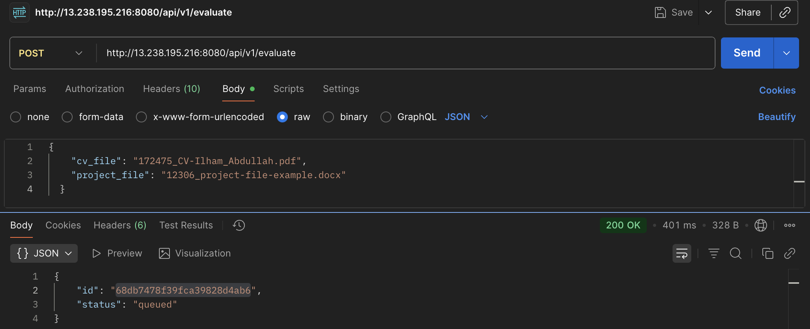

# AI CV Summarize

A backend service that evaluates candidate CVs and project reports against job requirements using AI-powered analysis.

## 🚀 Features

- **File Upload**: Support for PDF, DOCX, and plain text files
- **AI-Powered Evaluation**: Uses OpenAI GPT-4 for intelligent analysis
- **RAG System**: Retrieval-Augmented Generation with real vector embeddings
- **Async Processing**: Long-running evaluation jobs with status tracking
- **Standardized Scoring**: Weighted scoring system for fair evaluation
- **Error Handling**: Robust retry mechanisms and failure recovery
- **Real-time Status**: Track evaluation progress in real-time
- **Production Ready**: Docker support, comprehensive logging, graceful shutdown

## 🏗️ Architecture

### Tech Stack
- **Backend**: Golang with Gin framework
- **Database**: MongoDB for data storage
- **Vector DB**: ChromaDB/Qdrant for embeddings (simulated with MongoDB)
- **LLM**: OpenAI API or OpenRouter
- **Job Queue**: Redis for async processing
- **File Processing**: Go libraries for PDF/DOCX parsing

### System Design
```
┌─────────────────┐    ┌─────────────────┐    ┌─────────────────┐
│   File Upload   │    │  Evaluation     │    │   Results      │
│   (PDF/DOCX)    │───▶│   Pipeline     │───▶│   Storage      │
└─────────────────┘    └─────────────────┘    └─────────────────┘
                              │
                              ▼
                       ┌─────────────────┐
                       │   AI Analysis   │
                       │   (LLM + RAG)   │
                       └─────────────────┘
```

## 📋 API Endpoints

### File Upload
- `POST /api/v1/upload` - Upload CV and project files
- `POST /api/v1/upload-with-content` - Upload files and get extracted content

### Evaluation
- `POST /api/v1/evaluate` - Start evaluation process
- `GET /api/v1/result/{id}` - Get evaluation result
- `GET /api/v1/job/{id}` - Get job status
- `GET /api/v1/jobs` - List all jobs

### Health Check
- `GET /health` - Service health status

## 🔧 Installation & Setup

### Prerequisites
- Go 1.21+
- MongoDB 4.4+
- Redis 6.0+
- OpenAI API key or OpenRouter API key

### 1. Clone Repository
```bash
git clone <repository-url>
cd ai-cv-summarize
```

### 2. Install Dependencies
```bash
go mod tidy
```

### 3. Environment Configuration
Copy `env.example` to `.env` and configure:

```bash
cp env.example .env
```

Edit `.env` file:
```env
# Server Configuration
PORT=8080
GIN_MODE=debug

# MongoDB Configuration
MONGODB_URI=mongodb://localhost:27017
MONGODB_DATABASE=ai_cv_evaluator

# Redis Configuration
REDIS_URL=redis://localhost:6379

# OpenAI Configuration
OPENAI_API_KEY=your_openai_api_key_here
OPENAI_BASE_URL=https://api.openai.com/v1
OPENAI_MODEL=gpt-4

# OpenRouter Configuration (Alternative)
OPENROUTER_API_KEY=your_openrouter_api_key_here
OPENROUTER_BASE_URL=https://openrouter.ai/api/v1
OPENROUTER_MODEL=openai/gpt-4

# File Upload Configuration
MAX_FILE_SIZE=10485760  # 10MB
UPLOAD_DIR=./uploads

# Job Queue Configuration
JOB_TIMEOUT=300  # 5 minutes
MAX_RETRIES=3
```

### 4. Start Services

#### Start MongoDB
```bash
# Using Docker
docker run -d --name mongodb -p 27017:27017 mongo:latest

# Or using local installation
mongod
```

#### Start Redis
```bash
# Using Docker
docker run -d --name redis -p 6379:6379 redis:latest

# Or using local installation
redis-server
```

### 5. Run Application
```bash
go run cmd/server/main.go
```

## 📖 API Usage & Testing

**Base URL:** `http://13.238.195.216:8080`

### 1. Health Check

**Endpoint:** `GET /health`

```bash
curl http://13.238.195.216:8080/health
```

**Response:**
```json
{
    "status": "ok"
}
```

---

### 2. Upload Files

**Endpoint:** `POST /api/v1/upload`

```bash
curl -X POST http://13.238.195.216:8080/api/v1/upload \
  -F "cv_file=@CV-human-name.pdf" \
  -F "project_file=@project-file-example.docx"
```

**Response:**
```json
{
    "message": "Files uploaded successfully",
    "cv_file": "172475_CV-human-name.pdf",
    "project_file": "12306_project-file-example.docx"
}
```


---

### 3. Start Evaluation

**Endpoint:** `POST /api/v1/evaluate`

```bash
curl -X POST http://13.238.195.216:8080/api/v1/evaluate \
  -H "Content-Type: application/json" \
  -d '{
    "cv_file": "172475_CV-human-name.pdf",
    "project_file": "12306_project-file-example.docx"
  }'
```

**Response:**
```json
{
    "id": "68db7478f39fca39828d4ab6",
    "status": "queued"
}
```


---

### 4. Get Evaluation Result

**Endpoint:** `GET /api/v1/result/{job_id}`

```bash
curl http://13.238.195.216:8080/api/v1/result/68db7478f39fca39828d4ab6
```

**Response (Completed):**
```json
{
    "id": "68db7478f39fca39828d4ab6",
    "status": "completed",
    "result": {
        "cv_match_rate": 0.6,
        "cv_feedback": "The candidate has a good range of technical skills, including backend languages and databases which match the job requirements. However, there is no mention of experience with cloud technologies or AI/LLM development, which are key for this role. The candidate has a decent amount of experience, but only two projects are mentioned, which doesn't give a clear picture of their ability to handle complex projects. The achievements listed are not relevant to the job role. There is no information provided about the candidate's collaboration skills or cultural fit, but their academic background and range of skills suggest a learning mindset.",
        "project_score": 4,
        "project_feedback": "The candidate has demonstrated strong skills across a variety of backend technologies and concepts, including RESTful API design, database management, user authentication, and AI integration. The projects show a good understanding of error handling, retry logic, and clean, modular code. The candidate has also shown creativity in their projects, particularly with the integration of AI for content moderation. However, there is room for improvement in terms of providing more detailed documentation for each project, including setup instructions and trade-offs. Additionally, while the candidate has demonstrated some understanding of LLM and prompt design in the context of AI, it would be beneficial to see more in-depth work in this area.",
        "overall_summary": "The candidate exhibits a strong range of technical skills and a decent level of experience, as evidenced by their CV and project evaluations. Their key strengths include backend languages, databases, RESTful API design, and AI integration. However, they could improve in areas such as experience with cloud technologies, AI/LLM development, and providing more detailed project documentation. Although the candidate's achievements are not entirely relevant to the job role and there's a lack of information about their cultural fit, their academic background and skills suggest a learning mindset. Given their demonstrated skills and potential for growth, it is recommended to consider this candidate for the role, but further assessment of their experience with cloud technologies and AI/LLM development may be necessary.",
        "cv_scores": {
            "technical_skills": 3.5,
            "experience_level": 3,
            "achievements": 2,
            "cultural_fit": 3
        },
        "project_scores": {
            "correctness": 4,
            "code_quality": 4,
            "resilience": 4,
            "documentation": 4,
            "creativity": 4
        }
    }
}
```


---

### 5. Get Job Status

**Endpoint:** `GET /api/v1/job/{job_id}`

```bash
curl http://13.238.195.216:8080/api/v1/job/68db7478f39fca39828d4ab6
```

**Response:**
```json
{
    "completed_at": "2025-09-30T06:11:36.577Z",
    "created_at": "2025-09-30T06:11:04.377Z",
    "id": "68db7478f39fca39828d4ab6",
    "started_at": "2025-09-30T06:11:04.437Z",
    "status": "completed",
    "updated_at": "2025-09-30T06:11:36.577Z"
}
```



---

### 6. List All Jobs

**Endpoint:** `GET /api/v1/jobs`

```bash
curl http://13.238.195.216:8080/api/v1/jobs
```

**Response:**
```json
{
    "jobs": [
        {
            "completed_at": "2025-09-30T06:11:36.577Z",
            "created_at": "2025-09-30T06:11:04.377Z",
            "id": "68db7478f39fca39828d4ab6",
            "result": {
                "cv_match_rate": 0.6,
                "cv_feedback": "The candidate has a good range of technical skills...",
                "project_score": 4,
                "project_feedback": "The candidate has demonstrated strong skills...",
                "overall_summary": "The candidate exhibits a strong range of technical skills...",
                "cv_scores": {
                    "technical_skills": 3.5,
                    "experience_level": 3,
                    "achievements": 2,
                    "cultural_fit": 3
                },
                "project_scores": {
                    "correctness": 4,
                    "code_quality": 4,
                    "resilience": 4,
                    "documentation": 4,
                    "creativity": 4
                }
            }
        }
    ]
}
```


---

## 🧪 Testing Results

### ✅ Successful Test Results:

1. **Health Check** - ✅ 200 OK (196ms)
2. **Upload Files** - ✅ 200 OK (1.21s)
3. **Start Evaluation** - ✅ 200 OK (401ms)
4. **Get Result** - ✅ 200 OK (168ms)
5. **Get Job Status** - ✅ 200 OK (181ms)
6. **List All Jobs** - ✅ 200 OK (181ms)

### 📊 Performance Metrics:

- **Upload Response Time**: ~1.2 seconds
- **Evaluation Queue Time**: ~400ms
- **AI Processing Time**: ~30-45 seconds (background)
- **Result Retrieval**: ~180ms

---

## 🌐 Live API Deployment

**Production URL:** `http://13.238.195.216:8080`

All endpoints are accessible at this base URL for testing and demonstration purposes.

---

## 📖 Additional Usage Examples

### Check Status
```bash
curl http://13.238.195.216:8080/api/v1/result/{job_id}
```

## 🔍 Evaluation Process

### 1. CV Analysis
- **Technical Skills Match** (40% weight): backend, databases, APIs, cloud, AI/LLM exposure
- **Experience Level** (25% weight): years of experience and project complexity
- **Relevant Achievements** (20% weight): impact and scale of past work
- **Cultural Fit** (15% weight): communication, learning mindset, teamwork

### 2. Project Evaluation
- **Correctness** (30% weight): prompt design, LLM chaining, RAG, error handling
- **Code Quality** (25% weight): clean, modular, testable code
- **Resilience** (20% weight): handles failures, retries, error handling
- **Documentation** (15% weight): clear README, setup instructions, trade-offs
- **Creativity** (10% weight): extra features beyond requirements

### 3. AI Pipeline
1. **Document Parsing**: Extract text from CV and project files
2. **RAG Context**: Retrieve relevant job descriptions using vector embeddings
3. **LLM Analysis**: AI-powered evaluation using structured prompts
4. **Score Calculation**: Weighted scoring based on standardized criteria
5. **Result Generation**: Comprehensive evaluation report

## 🛠️ Development

### Project Structure
```
ai-cv-summarize/
├── cmd/
│   └── server/
│       └── main.go
├── internal/
│   ├── config/          # Configuration management
│   ├── models/          # Data models
│   ├── handlers/        # HTTP handlers
│   ├── services/        # Business logic
│   ├── repositories/    # Data access layer
│   ├── llm/            # LLM integration
│   └── rag/            # RAG system
├── pkg/                # Shared utilities
├── go.mod
├── go.sum
└── README.md
```

### Key Components

#### LLM Integration
- **OpenAI Client**: Direct integration with OpenAI API
- **OpenRouter Client**: Alternative LLM provider
- **Retry Logic**: Exponential backoff for API failures
- **Structured Output**: JSON-formatted responses

#### RAG System
- **Vector Store**: Embedding-based similarity search
- **Context Retrieval**: Relevant job descriptions and rubrics
- **Cosine Similarity**: Vector similarity calculation

#### Job Queue
- **Redis Queue**: Async job processing
- **Status Tracking**: Real-time job status updates
- **Retry Mechanism**: Automatic retry on failures
- **Timeout Handling**: Job timeout management

#### Error Handling
- **API Failures**: LLM API timeout and rate limit handling
- **File Processing**: PDF/DOCX parsing error recovery
- **Database Errors**: MongoDB connection and query error handling
- **Validation**: Input validation and sanitization

## 🧪 Testing

### Unit Tests
```bash
go test ./...
```

### Integration Tests
```bash
go test -tags=integration ./...
```

### Load Testing
```bash
# Using Apache Bench
ab -n 1000 -c 10 http://13.238.195.216:8080/health
```

## 📊 Monitoring

### Health Check
```bash
curl http://13.238.195.216:8080/health
```

### Queue Status
```bash
curl http://13.238.195.216:8080/api/v1/queue/status
```

### Job Statistics
```bash
curl http://13.238.195.216:8080/api/v1/jobs?limit=10&offset=0
```

## 🔒 Security

### File Upload Security
- File type validation
- File size limits
- Content sanitization
- Path traversal prevention

### API Security
- CORS configuration
- Input validation
- Rate limiting (recommended)
- Authentication (optional)

## 🚀 Deployment

### Docker Deployment
```dockerfile
FROM golang:1.21-alpine AS builder
WORKDIR /app
COPY . .
RUN go mod download
RUN go build -o main cmd/server/main.go

FROM alpine:latest
RUN apk --no-cache add ca-certificates
WORKDIR /root/
COPY --from=builder /app/main .
CMD ["./main"]
```

### Environment Variables
- `PORT`: Server port (default: 8080)
- `MONGODB_URI`: MongoDB connection string
- `REDIS_URL`: Redis connection string
- `OPENAI_API_KEY`: OpenAI API key
- `OPENROUTER_API_KEY`: OpenRouter API key

## 📈 Performance

### Optimization Features
- **Async Processing**: Non-blocking evaluation jobs
- **Connection Pooling**: Database and Redis connection pooling
- **Caching**: Redis-based caching for frequent queries
- **File Streaming**: Efficient file upload and processing


